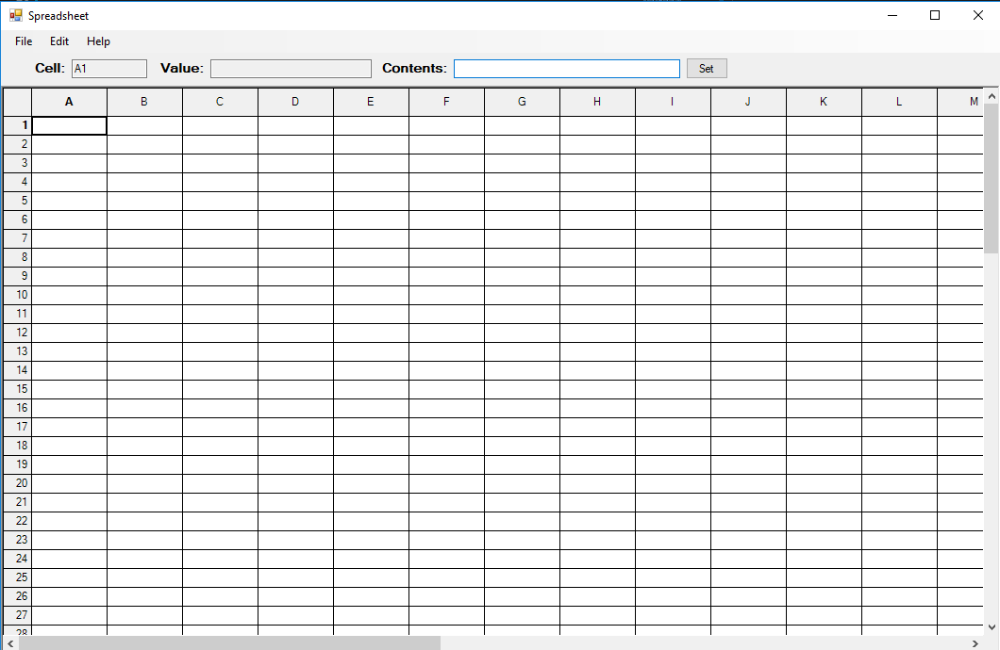

# SpreadSheet Desktop Application

This project was an amalgamation of projects for the first half of the semester from my Software Practice I course at the University of Utah. The spreadsheet was built using C# and the .NET framework utilizing the .NET's Windows Forms Application. The project includes a FormulaClass with an infix expression evaluator, a dependency graph data structure, a spreadsheet model, and a spreadsheet GUI. Each of these projects can be found as .NET solutions in this repository. The software can be tested/run by opening up the executable from the SpreadSheet-GUI solution.

## Getting started

The following instructions will allow you to run the software on your local machine. Because the project was developed using .NET's Windows Forms Application, it will only run on a Windows machine. The project was built and tested using Microsofts Visual Studio IDE, so if you are interested in seeing or testing the code, it is recommended that is the IDE you use. 

### Running the Game Using Visual Studio

1. Clone the repository
2. Open up the SpreadSheet-GUI Solution
3. Build/Run the project.

### Running the Game Without Visual Studio

1. Clone the repository (or navigate in GitHub)
2. Navigate to /SpreadSheetExecutables/SpreadsheetGUI.exe
3. Double click or run the .exe file.

### Game Logistics

The application was designed to run as a standard spreadsheet, much like Microsoft's Excel, although without many of the bells and whistles. The top of the application allows you to see what cell is selected, and what formula is associated with each cell. You can fill in the contents of each cell by using the input box at the top of the application. Prepend formulas to be calculated with an '=' operator. For example, the contents of the b2 cell might be "a1+10". You can save and delete files using the .sprd extension.

### Final Thoughts and Acknowledgements

This was my first go at a Desktop application, and my first time building a real project using C# and the .NET framework. Because of this, there are going to be numerous bugs within the application. With that being said however, I'm proud of the way it turned out.
